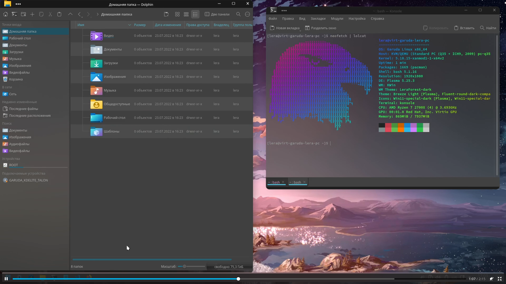

# linux-post-install

Настройка ОС, доустановка программ, перенос профиля пользователя

Работает на Garuda Linux (из опробованных множеств дистрибутивов, этот мне нравится больше всего для десктопа).

[Full on youtube](https://www.youtube.com/watch?v=Bs1gLrFPDyI)

### Donate
[Tinkoff](https://www.tinkoff.ru/rm/fadeeva.valeriya96/9bLRi79066)

[YooMoney](https://yoomoney.ru/to/4100115921160758)

[Qiwi](https://qiwi.com/n/VALERIAFADEEVA)

Etherium 0x981FBf878fe451BDB83BEaF68078394d4B13213f
